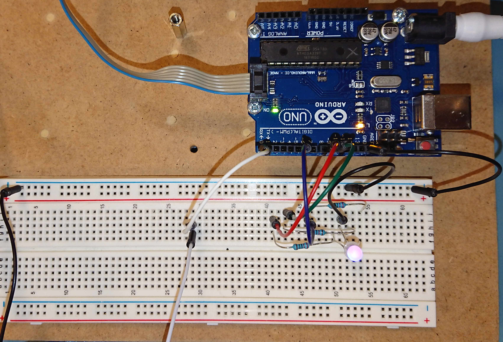

# ProjectJoachimHueSlave
 Slave modul til ProjectJoachimHue

Denne README inkluderer kun opsætningen af slave modulet, andre informationer findes i README til [hovede projektet](https://github.com/JoachimToefting/ProjectJoachimHUE)

## Opsætning af Hardware

Bruges listen findes i hoved projektet.
link til [pinout](resources/images/UNO_pinout.webp)

Billede af Arduino UNO:

RGBLED'en farver skal igennem 330 Ohms modstand inden de går til porten.
| RGBLED | Board | PORT  |
| :----: | :---: | :---: |
|  red   |   9   |  PB1  |
| green  |  10   |  PB2  |
|  blue  |   6   |  PD6  |
|  GND   |  GND  |

Opsætning af forbindelse ses i hovede projektet.